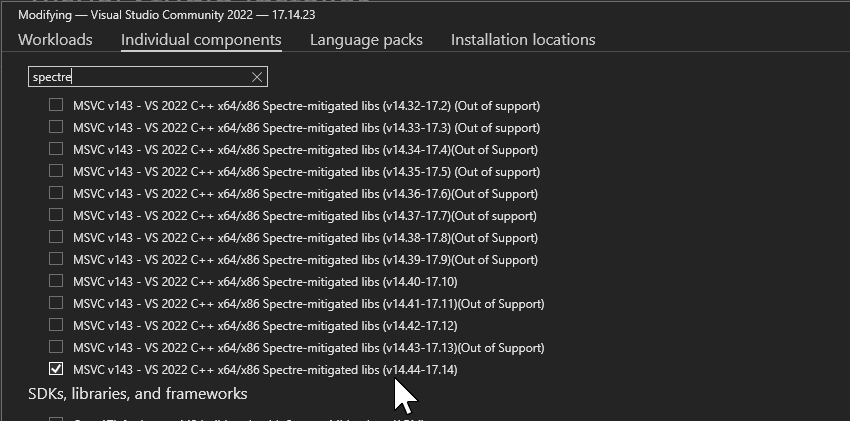

# Codex DMG -> Windows

This repository provides a **Windows-only runner** that extracts the macOS Codex DMG and runs the Electron app on Windows. It unpacks `app.asar`, swaps mac-only native modules for Windows builds, and launches the app with a compatible Electron runtime. It **does not** ship OpenAI binaries or assets; you must supply your own DMG and install the Codex CLI.

## Requirements
- Windows 10/11
- Node.js
- 7-Zip (`7z` in PATH)
- If 7-Zip is not installed, the runner will try `winget` or download a portable copy
- Codex CLI installed (`npm i -g @openai/codex`, using a node package manager (in my case fnm) can cause issues regarding detecting codex-cli)
- git (for codex desktop)

## Visual Studio Installer (Required Libs)
If your build fails due to missing Spectre-mitigated libraries, install the option shown below in the Visual Studio Installer.



## Quick Start
1. Place your DMG in the repo root (default name `Codex.dmg`).
2. Run:

```powershell
.\scripts\run.ps1
```

Or explicitly:

```powershell
.\scripts\run.ps1 -DmgPath .\Codex.dmg
```

Or use the shortcut launcher:

```cmd
run.cmd
```

The script will:
- Extract the DMG to `work/`
- Build a Windows-ready app directory
- Auto-detect `codex.exe`
- Launch Codex

## Screenshots


## Build Installer (.exe)

### Requirements
- WiX Toolset (for MSI)
- NSIS (for EXE)
- Desktop development with C++ (
- If your build fails due to missing Spectre-mitigated libraries, install the option shown below in the Visual Studio Installer.
- .Net sdk 8


One-shot build (runs `run.ps1`, then produces `installer\out\CodexDesktop-setup.exe`):

```powershell
pwsh -NoProfile -ExecutionPolicy Bypass -File .\scripts\build-setup-exe.ps1
```

Skip re-extraction if `work/` is already populated:

```powershell
pwsh -NoProfile -ExecutionPolicy Bypass -File .\scripts\build-setup-exe.ps1 -Reuse
```

Allow building the installer without a real Codex CLI present (CI-only, uses a placeholder):

```powershell
pwsh -NoProfile -ExecutionPolicy Bypass -File .\scripts\build-setup-exe.ps1 -AllowMissingCodexCli
```

Output:

- `installer\out\CodexDesktop-setup.exe`

## Notes
- This is not an official OpenAI project.
- Do not redistribute OpenAI app binaries or DMG files.
- The Electron version is read from the app's `package.json` to keep ABI compatibility.

## Cleaning Up
If the project folder becomes too large, you can clear all build artifacts and temporary files with:

```powershell
Remove-Item -Recurse -Force work, installer\out, codexd-launcher\bin, codexd-launcher\obj -ErrorAction SilentlyContinue
```

## License
MIT (For the scripts only)
